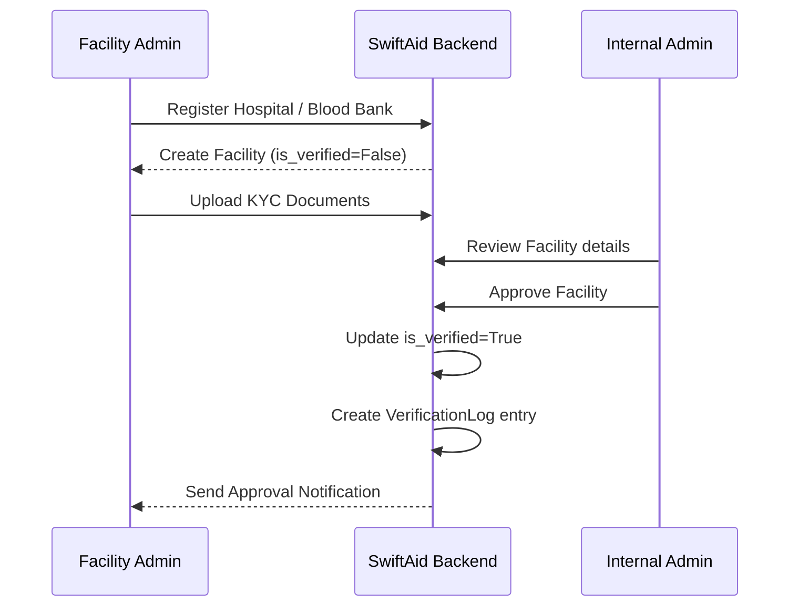
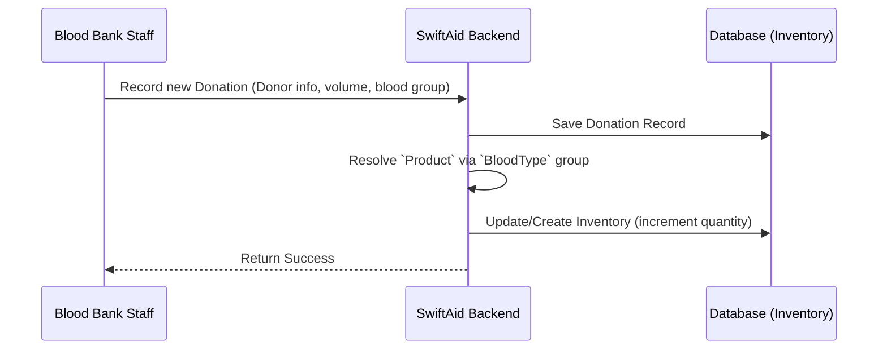
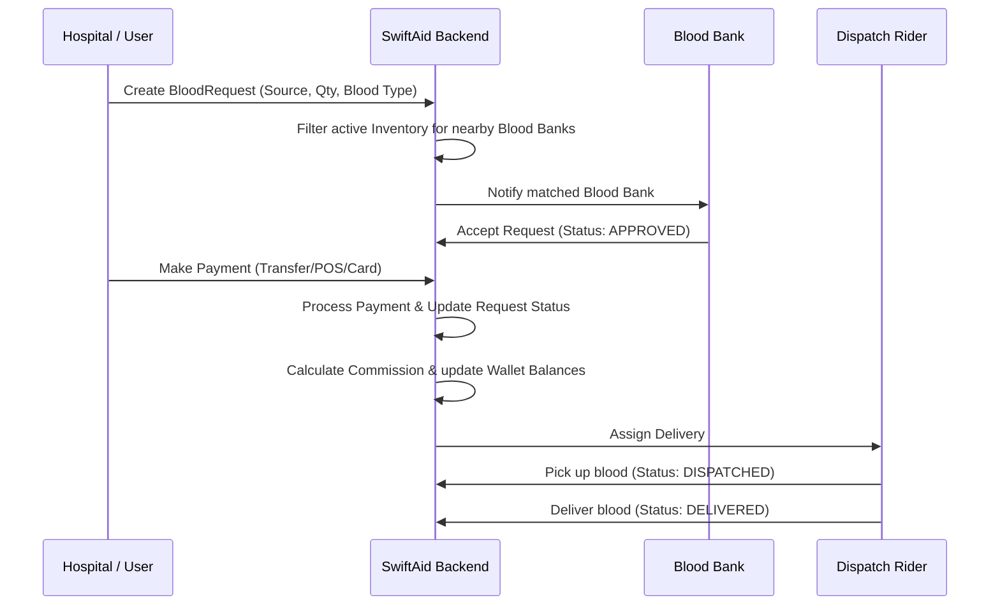
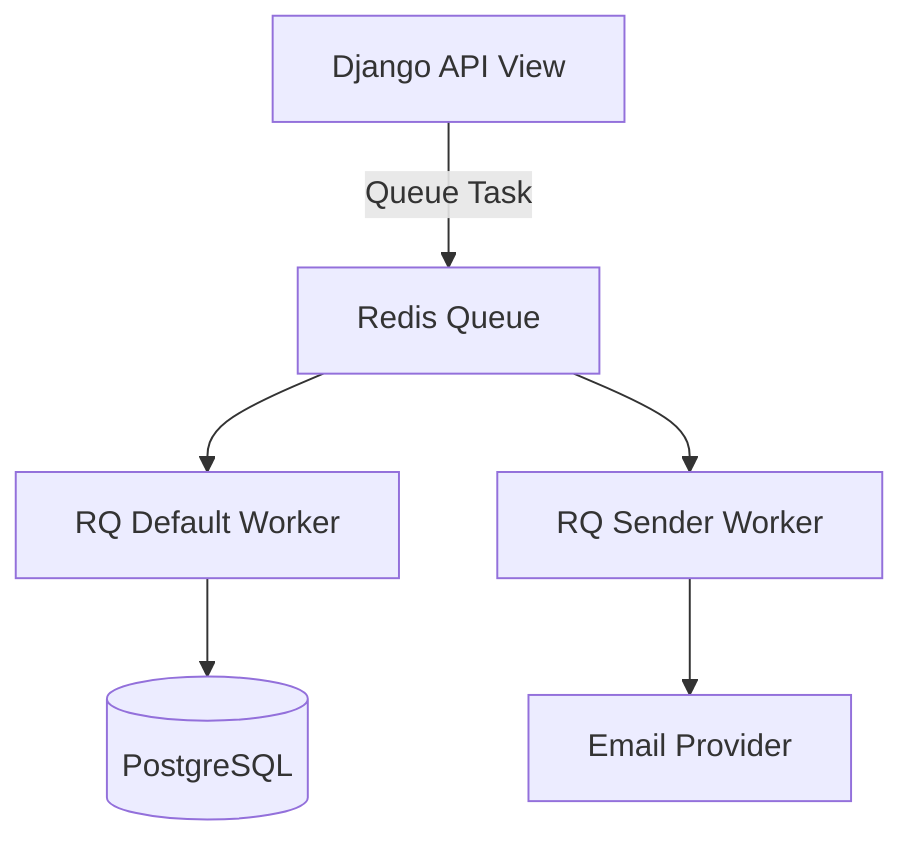

# SwiftAid Backend Architecture & Data Flow

This document details the critical workflows and architectural components of the SwiftAid backend system.

## Core Architectural Modules

The backend is modularized into distinct domains to ensure separation of concerns:

- **Users Module**: Manages Users, Roles, Hospitals, Blood Banks, and Verification Logs.
- **Inventory Module**: Handles Blood Types, Products, Stock Levels (Inventory), and Donations.
- **Transaction Module**: Manages the lifecycle of a `BloodRequest` from initiation to delivery.
- **Payment Module**: Handles Payments, Wallet Balances, Bank Details, and Payouts.
- **Notification Module**: Responsible for Async events (Emails, SMS, WebSockets).

---

## System Workflows

### 1. Organization Onboarding & Verification Flow

Facilities must be verified before they can actively participate in transactions.

### 2. Inventory Management Flow

Blood Banks manage their inventory either manually or through processing donations.

### 3. Blood Request & Transaction Flow

This is the core business flow where a Hospital or User requests blood, and a Blood Bank fulfills it.

### 4. Payment & Commission Flow

When a transaction occurs, the system splits the payment between the platform (commission) and the blood bank.

1. **Payment Initiation**: A `Payment` record is created linking to the `BloodRequest`.
2. **Amount Calculation**: 
   - `total_amount = blood_price + service_fee + delivery_fee`
3. **Commission Split**:
   - `commission_amount` is calculated based on `GlobalConfig.commission_percentage`.
   - The platform takes the `commission_amount` (and delivery fees if applicable).
   - The remaining amount (`blood_bank_fee`) is credited to the `BloodBank.wallet_balance`.
4. **Payout**:
   - Blood Bank requests a withdrawal to their `BankDetail`.
   - A `Payout` record is generated. If free payouts are exhausted, a `payout_charge_fee` is deducted.

---

## Background & Asynchronous Processing

To ensure the API remains fast, the following tasks are offloaded to background queues using **Redis** and **Django-RQ**:

- **Emails/SMS**: Sending OTPs, order updates, and onboarding confirmations.
- **WebSocket Broadcasting**: Emitting real-time updates to Dispatch Riders and Hospitals when a request status changes.
- **Report Generation**: Exporting large transaction datasets for hospital/blood bank dashboards.

